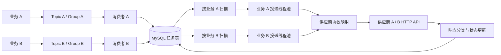

# HTTP 通知服务设计

本说明面向首次阅读仓库的评审者，直接回答作业中的系统边界、可靠性、失败处理、取舍和演进问题。实现基线为 `fcbbe36`；启动方式见 [README](../README.md)，验证证据见 [验证记录](VERIFICATION.md)。

## 目标与边界

接收多个内部业务系统提交的通知任务，按供应商协议调用外部 HTTP API，并对失败提供可恢复的处理路径。Java/Spring Boot 实现单实例 MVP，RocketMQ 接入、MySQL 保存任务。

上游负责业务事务与可靠发布；中台从接收后承担任务持久化、投递和失败处理；供应商负责业务幂等。允许重复调用，采用有限自动重试＋人工恢复，不保证无条件最终成功。不保证不同请求按序执行，也不解决旧状态覆盖新状态。

### 需求事实与本次设计选择

| 题目明确给出的事实 | 本次实现的选择 |
| --- | --- |
| 多个内部业务系统提交外部通知请求 | 使用 MQ 接入，两个预配置业务来源演示 |
| 外部是 HTTP(S)，地址、Header、Body 不同 | 中台维护两个模拟供应商的请求与响应映射 |
| 上游不关心外部返回值 | 上游不等待结果；中台解析响应并保存任务状态 |
| 尽可能可靠投递，自行说明语义与失败策略 | 持久化任务、允许重复、有限重试、失败人工恢复 |
| 只要求 MVP，可自行选择基础设施 | 单应用实例＋RocketMQ＋MySQL，不建设完整平台 |

题目没有给出 TPS、租户数量、供应商 SLA 或真实响应协议。扫描频率、并发和重试间隔是可运行的示例默认值，没有以未经测量的高吞吐量为由引入更多组件。业务隔离来自开发者提出的频率差异考虑，不是题目强制要求的完整多租户能力。

### 解决什么，不解决什么

| 问题 | 归属与本次范围 | 判断依据 |
| --- | --- | --- |
| 业务已提交但尚未发到 MQ | 上游负责，本项目不实现业务 Outbox/事务消息 | 中台不能恢复从未收到的事件；示例 SDK 不替代事务一致性 |
| 接收后的任务保留与消费重复 | 中台处理 | 任务落库后确认；唯一键检测重复 |
| 不同外部请求和业务码格式 | 中台处理 | 两套具体协议验证适配职责 |
| 暂时故障与长期不可用 | 中台处理 | 重试有上限，失败留存，提供人工入口 |
| 外部副作用只执行一次 | 供应商负责，本项目不保证 | 超时无法证明对方未执行，本地去重不能替代对方业务幂等 |
| 外部异步流程最终完成 | 本项目不追踪 | 没有供应商回调或查询协议；成功只按约定响应定义 |
| 同客户多个请求按序生效 | 本项目不保证 | 上游按序发送之后，消费并发和失败重试仍可能改变次序 |
| 完整租户权限与物理隔离 | 本项目不提供 | 只隔离接入和投递执行资源，底层设施仍共享 |
| 高可用、容量压测、完整审计 | 后续按需要演进 | 当前先验证单实例的任务恢复，未给出生产规模指标 |

## 一次通知怎样走完

业务 A/B 各使用独立 Topic 和 Consumer Group。消息只包含 requestId、supplier、operation、payload，业务身份由订阅配置决定。当前预配置两业务、两供应商，支持更新客户状态一个操作。

消费者调用 `TaskStore.accept`：校验消息、插入任务、提交事务，再向 RocketMQ 返回消费成功。唯一键为 `(business_id, request_id)`。重复同内容可确认；同标识异内容不能覆盖既有任务。

后台分别扫描各业务到期任务，按空闲容量交给各自的有界执行器。工作线程条件领取任务为 PROCESSING，持久化增加尝试数后才发 HTTP。HTTP 不占用数据库事务。响应由供应商协议解析，结果更新为成功、等待重试或失败。

独立业务执行资源限制相互挤占，数据库和 Broker 仍共享。没有按供应商/操作拆分额外队列，没有动态租户配置，也没有面向各业务用户的数据权限系统。



Topic 是按业务划分的逻辑通道，不等于只能有一个内部 MessageQueue；本地脚本给每个 Topic 配置一个读写队列用于演示。供应商和操作是任务路由字段，不与业务方一对一绑定。落库后 MQ 的接收阶段已经结束，因此 HTTP 资源隔离必须由后续调度和执行器实现，不能仅靠拆分 Topic。

| 模块 | 职责 | 关键方法 |
| --- | --- | --- |
| `RocketIngress` | 建立每业务消费者，返回消费成功或稍后重试 | `start`、`consume` |
| `TaskStore` | 提交、查重、领取、保存结果、重投、启动恢复 | `accept`、`claim`、`complete`、`replay`、`recover` |
| `DeliveryDispatcher` | 根据每业务空闲容量扫描与执行；结果写入故障时停止新增投递 | `start`、`scan`、`execute` |
| `SupplierGateway` | 将业务参数映射为两个具体 HTTP 协议并分类响应 | `deliver` |
| `OpsController` | 受令牌保护的任务查询、失败重投和运行状态 | `get`、`retry`、`status` |

### 接入契约与供应商协议

```json
{
  "requestId": "contact-update-001",
  "supplier": "supplier-a",
  "operation": "UPDATE_CONTACT_STATUS",
  "payload": { "contactId": "c-001", "status": "ACTIVE" }
}
```

- 接入的是业务通知意图，不是任意 URL 的通用 HTTP 代理。供应商地址与凭据由中台配置，消息不允许指定目标 URL。
- 当前消息最大 16 KiB；requestId 为 1–100 个字母、数字、下划线或连字符；contactId 为非空且不超过 100 字符；status 仅支持 ACTIVE/INACTIVE。
- 上游重发必须保持同一个 requestId。同业务下同标识同业务内容表示同一任务；同标识异内容拒绝覆盖。不同业务可使用相同 requestId。
- 请求组装使用 POST JSON。供应商 A 接收 contactId/status，Header 为 X-Api-Key；B 接收 user_id/enabled，Header 为 Bearer 认证，其中 ACTIVE 映射为 true。
- A 的数字 code=0 或 B 的 result=SUCCESS，结合 HTTP 2xx，才判定成功。A 的 code=1001 / B 的 TEMPORARY_FAILURE 表示可重试；A 的 code=2001 / B 的 INVALID_ARGUMENT 表示不可恢复。
- 未知响应不会默认为成功；真实供应商接入时需依据其文档重写判据，不能把这些模拟值当作行业通用协议。

`X-Notification-Id` 使用业务来源与请求标识组合，并在重试时保持稳定。这只是标识透传，本地模拟服务没有实际去重；最终业务幂等不由中台保证。

### 数据模型与实现依据

只有 `notification_task` 一张任务表，SQL 见 [schema.sql](../src/main/resources/schema.sql)。

| 字段组 | 用途 |
| --- | --- |
| id、business_id、request_id | 本地任务定位及业务范围内的提交去重 |
| supplier、operation_name、contact_id、contact_status | 本次投递的固定业务输入 |
| status、next_attempt_at | 决定任务当前是否可以被扫描和领取 |
| attempt_count、total_attempts、replay_count | 区分当前轮预算、累计尝试和人工重投 |
| last_error、created_at、updated_at | 保存最近失败原因和基础排查时间 |

唯一索引 `(business_id, request_id)` 负责接收查重；索引 `(business_id, status, next_attempt_at)` 服务于按业务扫描。HTTP 执行前的领取及计数在短事务内提交，网络调用在事务外，避免远端慢响应长时间占用数据库事务。

扫描按空闲执行容量取任务，线程池使用不存储排队任务的 `SynchronousQueue`；来不及交给线程的任务仍留在数据库，下一轮再取。进程内集合只防止当前进程重复提交同一在途任务，恢复的真实依据仍是数据库。

## 状态与故障窗口

### 投递语义的准确含义

本项目采用允许重复的“至少一次”投递思路：MQ 可能重投，中台对暂时失败也会再次尝试，并依靠供应商处理重复副作用。接收查重减少重复建任务，但不能把外部调用变成恰好一次。

HTTP 层的具体保证是**持久化任务＋有限重试＋失败可查询、可人工恢复**。它不构成无条件的端到端至少一次成功送达保证：达到预算、永久拒绝、长期故障或尚未人工恢复时，任务可以停留在 FAILED；甚至连续在登记尝试后、发请求前宕机，也可能耗尽预算而没有实际成功调用。说明这一限制比把“重试五次”写成“保证成功”更符合实现。

可靠性还依赖 MQ 与数据库按约定持久保存数据、上游成功发布以及故障后的恢复操作；单节点磁盘损坏不在第一版覆盖范围内。

| 状态 | 含义 | 下一步 |
| --- | --- | --- |
| PENDING | 已持久化，等待首次或人工重投 | 条件领取 |
| PROCESSING | 已登记一次尝试，调用结果尚未持久化 | 更新结果；进程异常后启动恢复 |
| RETRY_WAIT | 可重试失败，等待指定时间 | 到期领取 |
| SUCCEEDED | 供应商协议判定成功 | 终态 |
| FAILED | 不可恢复或本轮预算耗尽 | 人工处理后显式重投 |

| 故障位置 | 恢复依据 |
| --- | --- |
| DB 提交前 | 未报告 MQ 成功，消费重试 |
| DB 提交后、消费确认前 | 重复接收通过唯一键核对，不重建任务 |
| 消费确认后、HTTP 执行前 | MySQL 任务仍在，重新扫描 |
| 登记尝试后进程宕机 | PROCESSING 结果未知，预算未耗尽则安排重试，否则 FAILED |
| 外部成功、本地结果未提交 | 可能重复调用，供应商负责外部幂等 |
| HTTP 结果保存失败 | 只重试结果写入，不立即重复 HTTP；持续失败则停止新增投递，报告故障并等待受控重启 |

这里不使用 MQ 与 MySQL 的分布式事务：先数据库提交、后确认会产生可去重的重复窗口；若先确认后提交，则可能直接丢失任务，因此没有采用相反顺序。

启动恢复必须在扫描和消费者启动前完成，并且旧应用实例已经退出。既有 RETRY_WAIT 时间及次数不变，SUCCEEDED/FAILED 不会自动重新执行。登记后但 HTTP 尚未发出就宕机也占用一次预算，这个不确定窗口无法靠本地记录消除。

对于启动时的 PROCESSING：预算未耗尽则从恢复时刻按当前次数安排下一次重试，预算耗尽则转 FAILED 并标记结果未知。启动恢复不是人工重投，不重置轮次和次数。

## 重试和人工恢复

每轮最多 5 次尝试，四次间隔为 10 秒、30 秒、2 分钟、10 分钟，均可配置。网络异常、408/429/5xx、暂时失败业务码及未知响应有限重试，明确的其他 4xx 和不可恢复业务码直接失败。

内部运维查询与重投接口通过令牌保护。只有 FAILED 可以条件更新为 PENDING，当前轮次数清零，累计次数与最近失败原因保留。原参数不变；修改参数需要上游使用新标识提交。第一版没有管理页面或完整历史审计。

非法 MQ 消息或落库一直失败由 RocketMQ 重试和 DLQ 保留；恢复步骤见 README。DLQ 的有限保留不是永久存档，不能视为数据库任务的替代。

### 长期不可用时怎么办

1. HTTP 超时或临时失败后，将原因和下次执行时间持久化，释放执行线程；不在工作线程中睡眠等待分钟级重试。
2. 按 10 秒、30 秒、2 分钟、10 分钟间隔继续尝试，耗尽本轮预算进入 FAILED，停止自动 HTTP 请求。
3. 运维查询失败原因，修复供应商故障、凭据或配置，再显式重投。原业务参数错误则由上游纠正并生成新 requestId。
4. 显式重投开启新一轮，但保留累计尝试和最近错误；如果原因没有消除，任务仍可能再次失败。

第一版没有自动告警推送、失败任务列表页面或无限期重试；运维需通过日志、已知任务标识及死信查询介入。收到 429 当前按配置间隔重试，尚未解析供应商的 Retry-After 或实现供应商级速率限制。

`/internal/status` 只反映投递器是否已因执行异常进入停止状态，不是 Broker、数据库和所有供应商的综合健康检查。仅扫描数据库失败时会记录日志并在下一轮继续；执行中状态保存持续失败时停止后续扫描，各业务共享这一故障停止标志，已在执行的工作不因此被强制中止。

### 内部运维接口

| 接口 | 含义与结果 |
| --- | --- |
| GET /internal/tasks/{business}/{requestId} | 查询一条任务；不存在返回 404 |
| POST /internal/tasks/{business}/{requestId}/retry | 仅 FAILED 可重投；不存在 404，非失败或竞争失败 409 |
| GET /internal/status | 无停止标志返回 200，有停止标志返回 503 |

所有接口要求 `X-Ops-Token`，缺失或错误返回 401。它是管理员入口，不是面向业务系统的结果回调；成功返回的任务状态可能已被后台推进，调用方可再次查询。参数、累计次数和最近错误保留，当前轮计数归零、人工重投次数增加。

## 关键取舍与演进

### 为什么使用这些组件，不使用时怎么办

| 组件 / 机制 | 选择依据 | 替代方案与成本 |
| --- | --- | --- |
| RocketMQ | 开发者明确选择 MQ 接入并指定 RocketMQ；队列缓冲与消费重试适配当前异步入口 | HTTP 接口事务落库后返回受理结果，可复用投递链路，少维护 MQ，但改变上游契约；没有声称 RocketMQ 必然优于所有 MQ |
| MySQL InnoDB | 用事务、唯一键和可查询的任务状态表达接收、重试和人工恢复 | 直接 MQ→HTTP，依靠消费重试和死信管理任务，可少一套存储，但需重新设计查询、人工操作及重试状态；本地文件数据库也可演示，但未选择为当前运行方案 |
| JDK 调度与独立执行器 | 单实例、少量固定业务，状态已在任务表中，无需另一调度平台 | 外部调度框架适合更复杂分片与管理，本版会增加部署和任务状态协同成本 |
| 显式 JDBC/TransactionTemplate | 接收提交、领取条件和预算更新可以直接对应 SQL，便于人工 review | ORM 也能实现，但该表模型简单，本版不引入额外实体生命周期和仓储层 |
| 两个具体协议分支 | 当前仅两个协议、一个操作，先证明映射与错误分类 | 供应商数量扩大后拆适配器接口与注册，不提前建设通用模板或脚本引擎 |

RocketMQ 采用 Remoting 客户端与 Broker 5.3.2，减少 gRPC Proxy 部署；消费成功通过监听器返回值报告，不能照搬 RabbitMQ 的 basicAck。单 Broker 配置 SYNC_FLUSH 只说明本地刷盘取向，不等于复制、高可用或防止磁盘损坏。

### 本次控制住的复杂度

| 未采用 / 延后的方案 | 为什么不纳入第一版 | 当前替代 |
| --- | --- | --- |
| 完整多租户、动态开户、每租户独立库 | 实际只验证少量固定业务，需求没有权限体系与租户生命周期 | 预配置业务、独立 Topic/消费者/投递资源 |
| 多实例抢占、租约与分布式调度 | 会新增执行者竞争、全局并发预算和旧结果覆盖问题 | 单实例，启动时恢复未完成任务 |
| 无限自动重试 | 长期错误持续占用容量，没有终止与介入点 | 有限重试＋失败保留＋人工重投 |
| 通用供应商规则引擎 | 两个具体协议不足以证明需要一套配置语言 | 集中、直白的协议映射代码 |
| Redis 状态、额外缓存 | 任务表已经是持久化事实来源，未测得缓存需求 | 直接读写 MySQL 并建立扫描索引 |
| 在中台实现外部业务幂等 | 调用方无法原子控制供应商的副作用 | 保留稳定标识，明确供应商职责 |
| 管理前端和全量审计历史 | 核心验收需要可查询、可重投，不要求管理产品 | 内部接口、累计次数、最近失败原因 |

上述表格区分已讨论后收敛的方案与未引入的扩展，并不表示 AI 曾经逐项要求实现它们。实际被拒绝或纠正的 AI 建议见 [AI_USAGE.md](../AI_USAGE.md)。

### 根据什么信号演进

| 观察到的变化 | 优先改什么 | 要继续保证什么 |
| --- | --- | --- |
| 单实例停机时间无法接受 | 增加应用实例；设计原子领取、租约、旧执行者写入保护和全局并发预算 | 接收去重、未知结果可恢复，不能只增加副本数 |
| 积压或扫描延迟增长 | 根据查询计划调整批量、索引、状态分区及历史归档，必要时改投递唤醒方式 | 每业务资源约束仍生效，失败任务可查询 |
| 供应商变多、协议变化频繁 | 抽取供应商适配器与协议契约测试 | 业务请求与供应商响应判定保持可追溯 |
| 同一供应商慢响应或配额成为瓶颈 | 增加供应商级并发/速率限制、Retry-After 支持，按需要评估熔断 | 不替代已有业务方隔离，不无限堆积内存任务 |
| 业务方数量增长、资源静态分配浪费 | 引入按业务配额的共享调度或独立部署分组 | 不让大业务持续饿死小业务 |
| 失败恢复需要多人协作或审计 | 增加失败列表、告警、操作人和逐次尝试记录 | 人工动作留痕，终态和预算不可随意重置 |
| 对基础设施故障的容忍度降低 | 评估 RocketMQ 复制、MySQL 高可用和备份恢复演练 | 分别验证持久性与可用性，不将服务重启等同容灾 |

以上是演进路径，没有使用未经测量的具体 TPS 阈值或声称这些能力已实现。

## 依据与 Review

完整需求映射、用户决策和实现推导在 [plan](plans/http-notification.md)，不是将 AI 的建议当作用户原始要求。

参考官方文档：[Spring Boot 3.5 系统要求](https://docs.spring.io/spring-boot/3.5/system-requirements.html)、[Spring 显式事务](https://docs.spring.io/spring-framework/reference/data-access/transaction/programmatic.html)、[RocketMQ Remoting PushConsumer](https://rocketmq.apache.org/docs/4.x/consumer/02push/)、[MySQL InnoDB 事务](https://dev.mysql.com/doc/refman/8.4/en/innodb-autocommit-commit-rollback.html)。Remoting API 随客户端依赖编译验证，不能与 RocketMQ 5.x gRPC API 混用。
